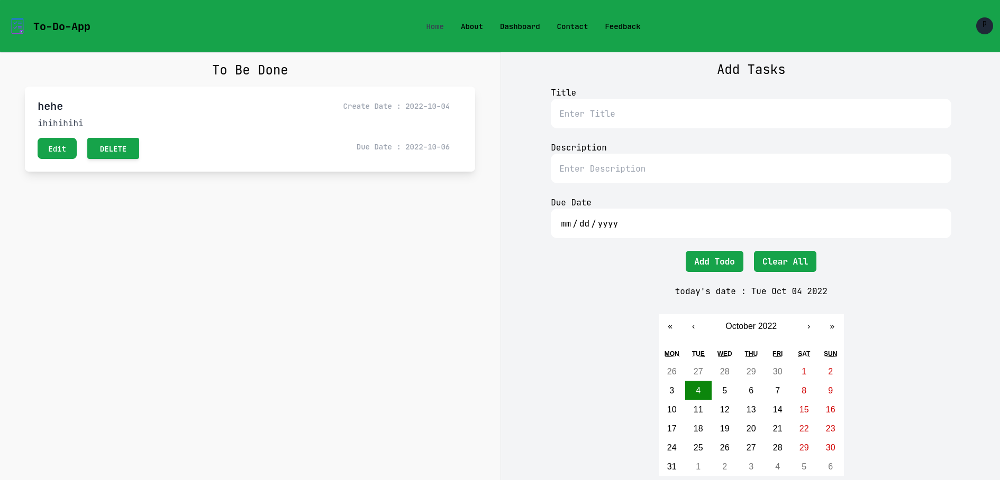

## PERN Stack Simple To-do-App

This is a simple to-do-app built with the PERN stack. It is a simple CRUD app that allows you to create, read, update, and delete to-do items. It is a simple app that is meant to be a learning tool for those who are interested in learning the PERN stack. 

### Showcase 



### Getting Started

To get started, you will need to have the following installed on your machine:

- Node.js
- PostgreSQL

Once you have those installed, you will need to clone this repository and install the dependencies. 

```bash
git clone https://github.com/tyzrex/PERN-CRUD-Web-App.git pern-todo-app
cd pern-todo-app
npm install
```

Once you have the dependencies installed, you will need to create a database and table in PostgreSQL. You can do this by running the following command in your terminal:

for database:

```bash
CREATE DATABASE todoapp;
```

Go inside the database:

```bash
\c todoapp
```

for table:

```bash
CREATE TABLE todo(
    TODO_ID SERIAL PRIMARY KEY,
    TITLE VARCHAR(255),
    DESCRIPTION VARCHAR(255),
    CREATE_DATE TIMESTAMP DEFAULT NOW(),
    DUE_DATE VARCHAR(255),
    DONE BOOLEAN DEFAULT FALSE
);
```


Once you have created the database, you will need to create a .env file in the root directory of the project. In this file, you will need to add the following:

```bash
DB_USER=your_postgres_username
DB_PASSWORD=your_postgres_password
DB_HOST=localhost
DB_PORT=5432
DB_DATABASE=todoapp
```

Now you can run the app by running the following command:

```bash
nodemon server.js
```

and for front end

```bash
npm start
```

Once the server is running, you can navigate to http://localhost:3000 to view the app.

### Built With

- [Node.js](https://nodejs.org/en/)

- [Express](https://expressjs.com/)

- [PostgreSQL](https://www.postgresql.org/)

- [React](https://reactjs.org/)


### Contributing

If you would like to contribute to this project, please feel free to submit a pull request.


